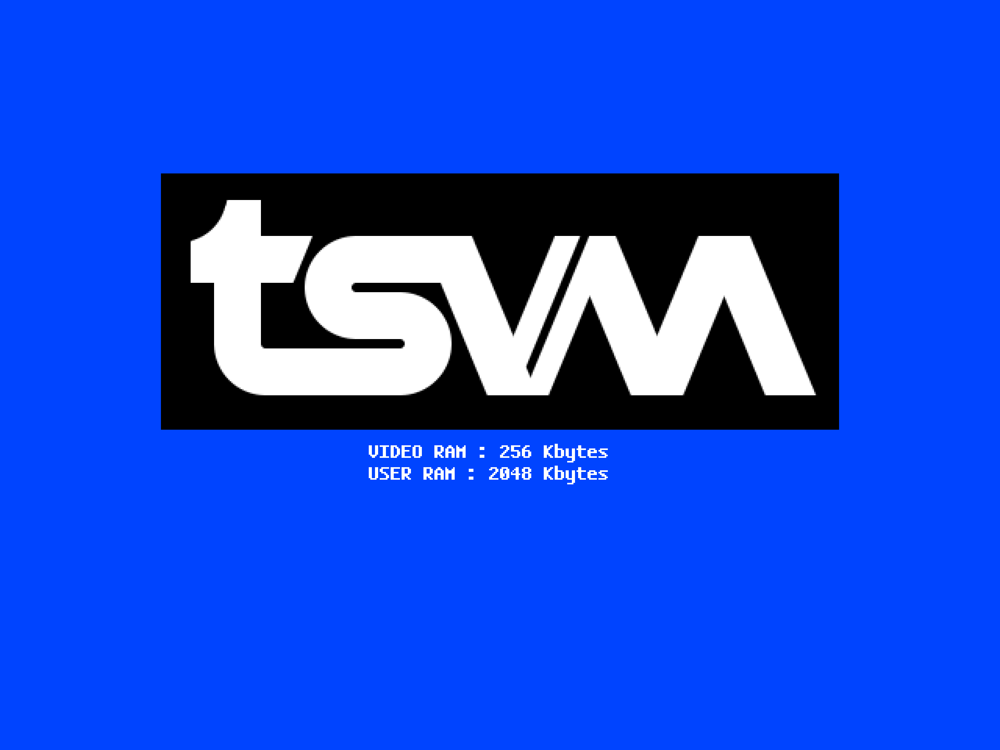

**tsvm** /tiː.ɛs.viː.ɛm/ is a virtual machine with the architecture that mimics the 8-bit era of
computers, and runs programs written in Javascript.

**tsvm** repository includes the virtual machine itself, the reference BIOS
implementation and a DOS; BASIC is provided by the [TerranBASIC](https://github.com/curioustorvald/TerranBASIC)
repository.