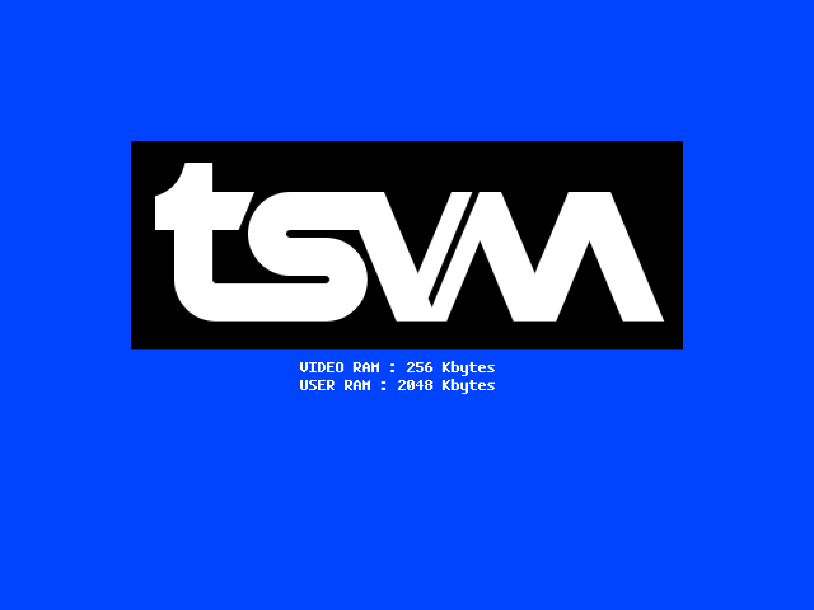

# tsvm

**tsvm** /tiː.ɛs.viː.ɛm/ is a fantasy computer platform: a virtual machine whose
architecture is inspired by the 8-bit and early 16-bit home computers, built
from the ground up around running JavaScript as its native machine code.

What started as "an 8-bit-flavoured VM that runs JS" has grown into a complete,
self-hosted retro computing ecosystem — with its own BIOS, operating system,
filesystem, video and audio codecs, video display coprocessor with its own
assembly language, tracker music format, and a stack of userland tools that
together come closer to a small alternate-history computer line than a
single-binary emulator.

This repository contains the virtual machine core, the reference BIOS
implementations, the **TVDOS** operating system, the **Videotron2K** video
display controller, hardware-accelerated codec backends for the **TEV / TAV /
TAD** media formats, and the multi-platform packaging scripts. The
[TerranBASIC](https://github.com/curioustorvald/TerranBASIC) repository
provides the matching BASIC dialect that ships on the system disk.

## What's actually in here

### The virtual machine

- **VM core** (`tsvm_core/`) — memory model, peripheral bus, MMIO, JS
  sandboxing through GraalVM, watchdog, DMA engine, and cooperative scheduling.
  Up to 8 hot-pluggable peripheral slots, each with a dedicated MMIO window
  and memory-space window mapped into the VM's negative address range.
- **Multiple BIOS implementations** (`assets/bios/`) — including the reference
  `tsvmbios.js`, an OpenBIOS variant, the TBM-BIOS for TerranBASIC machines,
  and the Pip-Boy-style `pipboot.rom`. BIOSes are first-class swappable
  components, not a fixed boot blob.
- **Reference monitor / debugger** (`mon.js`) for poking at memory and
  peripherals from a running machine.
- **Multi-platform packaging** (`buildapp/`) — scripts to produce Linux x86_64
  / ARM64 AppImages, macOS Intel / Apple Silicon bundles, and Windows builds,
  each with its own `jlink`-trimmed JDK 21 runtime.

### Peripherals (the "hardware")

Living under `tsvm_core/src/net/torvald/tsvm/peripheral/`:

- **Graphics adapters** — the standard `GraphicsAdapter`, plus `TexticsAdapter`
  for text-mode framebuffers, `ExtDisp` for external displays, and a
  `RemoteGraphicsAdapter` for networked rendering.
- **Audio devices** — `AudioAdapter` (the main programmable sound chip with
  PCM channels, an Impulse Tracker-style resonant low-pass filter, and a
  hardware-accelerated **TAD** decoder), `OpenALBufferedAudioDevice`, and the
  `MP2Env` MPEG audio environment.
- **Disk drives** — `TevdDiskDrive` (TEVD custom filesystem),
  `ClusteredDiskDrive`, `TestDiskDrive`, and a latency-simulator script for
  testing slow-storage behaviour.
- **Networking and serial** — `HttpModem`, `HSDPA` / `HostFileHSDPA` for
  high-speed packet I/O, `SerialStdioHost`, `BlockTransferInterface` /
  `BlockTransferPort`.
- **Terminals and displays** — `TTY`, `GlassTty`, `TermSim`, and a
  `CharacterLCDdisplay` for HD44780-flavoured projects.
- **Memory expansion** — `RamBank` for bank-switched memory, plus a
  programmable `TestFunctionGenerator`.

### Videotron2K — the video coprocessor

Videotron2K is a programmable video display controller with its **own
assembly-like language**, six general registers (`r1`–`r6`), special registers
(`tmr`, `frm`, `px`, `py`, `c1`–`c6`), a scene-based programming model, and
conditional postfixes (`zr`, `nz`, `gt`, `ls`, `ge`, `le`). Programs declare
`SCENE` blocks and dispatch them with `perform`. Drawing primitives include
`plot`, `fillin`, `fillscr`, and `goto`. See `Videotron2K.md` and the VDC
implementation under `tsvm_core/.../vdc/`.

### TVDOS — the operating system

`assets/disk0/tvdos/` is a complete DOS-style userland:

- **Kernel and drivers** — `TVDOS.SYS`, `HSDPADRV.SYS`, `hyve.SYS`,
  installable drivers under `moviedev/` and `tuidev/`.
- **Custom filesystem** — TEVD, with the on-disk format documented in
  `tvdos/filesystem.md`.
- **Internationalisation** — Colemak / Dvorak / QWERTY keymaps and an `i18n/`
  resource tree.
- **Userland binaries** (`tvdos/bin/`) — a shell (`command.js`), file tools
  (`hexdump`, `less`, `tee`, `touch`, `printfile`, `writeto`, `defrag`,
  `lfs`, `drives`), an editor (`edit.js`), a file manager (`zfm.js`), a
  network fetcher (`geturl`), gzip/Zstd helpers, palette tools, and a battery
  of media players (`playmp2`, `playpcm`, `playwav`, `playmv1`, `playtev`,
  `playtav`, `playtad`, `playucf`).
- **Taut tracker** — a full in-VM tracker (`taut.js`,
  `taut_instredit.js`, `taut_sampleedit.js`, `taut_notationedit.js`,
  `taut_fileop.js`) with its own font and chrome assets.

### Codecs and media formats

tsvm ships a small but serious codec lab. Encoders are written in C and live
in `video_encoder/`; decoders are split between JavaScript players in TVDOS
and hardware-accelerated Kotlin backends in the VM core.

- **iPF (Type 1 / 2 / 1-delta)** — picture and legacy movie format. Encoders:
  `encodeipf.js`, `encodemov.js`, `encodemov2.js`. Documented in
  `terranmon.txt`.
- **TEV (TSVM Enhanced Video)** — modern DCT codec with motion compensation,
  16×16 blocks, YCoCg-R 4:2:0, and either quality-mode or bitrate-mode rate
  control. Encoder: `video_encoder/encoder_tev.c`. Decoder: `playtev.js`,
  with `tevDecode` / `tevIdct8x8` / `tevMotionCopy8x8` accelerated in
  `GraphicsJSR223Delegate.kt`.
- **TAV (TSVM Advanced Video)** — successor to TEV based on the Discrete
  Wavelet Transform. Five wavelet types (5/3 reversible, 9/7 irreversible,
  CDF 13/7, DD-4, Haar), 6-level decomposition, EZBC sparsity coding,
  perceptual quantisation, and an optional **3D temporal DWT** that encodes
  whole groups of pictures as one unified wavelet tree. Includes a packet
  inspector (`tav_inspector.c`) and coefficient visualiser
  (`tav_visualise_coefficients.c`).
- **TAD (TSVM Advanced Audio)** — perceptual audio codec at 32 kHz stereo,
  using CDF 9/7 wavelets, M/S decorrelation, gamma compression, pre-emphasis,
  EZBC, and Zstd. Achieves ~2.5:1 compression vs. PCMu8 at quality 3 while
  preserving the full 0–16 kHz band. Designed to be embeddable inside TAV so
  audio chunks can align with video GOP boundaries.
- **Taud** — tracker module format with conversion tools from
  the major formats: `it2taud.py` (Impulse Tracker), `mod2taud.py`
  (ProTracker / FastTracker), `s3m2taud.py` (Scream Tracker 3), plus
  `2taud.sh` and shared helpers in `taud_common.py`. Note effects are
  documented in `TAUD_NOTE_EFFECTS.md`. The `AudioAdapter` runs the same
  IIR-only 2-pole resonant low-pass topology used by Impulse Tracker /
  OpenMPT / Schism.
- **MP2** — reference MPEG-1 Layer II environment via `MP2Env.kt` and
  `playmp2.js`.

### Languages and runtimes

- **JavaScript** is the VM's native code, executed by GraalVM in a sandboxed
  context with a curated set of host bindings (graphics, audio, filesystem,
  DMA, compression, networking, low-level peek/poke).
- **TerranBASIC** is provided by the
  [TerranBASIC](https://github.com/curioustorvald/TerranBASIC) repository and
  shipped as `tbas` on the system disk. The `TerranBASICexecutable/` subproject
  packages a BASIC-only flavour of the machine.
- **Videotron2K assembly** for VDC programs.

### Documentation

- `terranmon.txt` — the architecture reference (memory map, peripheral
  protocol, codec bitstreams).
- `doc/*.tex` — machine-readable LaTeX sources for the TSVM and TVDOS manuals,
  built with `doc/makepdf.sh`.
- `Videotron2K.md` — VDC programming guide.
- `TAUD_NOTE_EFFECTS.md` — tracker effect reference.
- `CLAUDE.md` — a condensed map of the project for collaborators (and
  language-model assistants) working in the tree.

## Building and running

### Prerequisites

JDK 21 runtimes laid out under `~/Documents/openjdk/` with platform-specific
names:

- `jdk-21.0.1-x86` — Linux AMD64
- `jdk-21.0.1-arm` — Linux Aarch64
- `jdk-21.0.1-windows` — Windows AMD64
- `jdk-21.0.1.jdk-x86` — macOS Intel
- `jdk-21.0.1.jdk-arm` — macOS Apple Silicon

`jlink` is then used to produce trimmed runtimes under `out/runtime-*`.

### Common entry points

- **Run the emulator** — `TsvmEmulator.java` (in `tsvm_executable/`).
- **Run TerranBASIC-only build** — `TerranBASIC.java` (in
  `TerranBASICexecutable/`).
- **Package an installable bundle** — pick the right script in `buildapp/`:
    - `build_app_linux_x86.sh`
    - `build_app_linux_arm.sh`
    - `build_app_mac_x86.sh`
    - `build_app_mac_arm.sh`
    - `build_app_windows_x86.sh`
- **Build C encoders** — in `video_encoder/`: `make` (TEV), `make tav`,
  `make tad`.

### Encoding sample media

```bash
# Quality-mode TEV encode
./encoder_tev -i input.mp4 -o clip.tev -q 3

# TAV with 9/7 wavelet, quality 4
./encoder_tav -i input.mp4 -w 1 -q 4 -o clip.tav

# TAV with 3D temporal DWT (GOP-unified encoding)
./encoder_tav -i input.mp4 --temporal-dwt -o clip.tav

# TAD audio at the highest quality
./encoder_tad -i input.mp4 -o track.tad -q 5
```

Then, inside TVDOS:

```
A:\> playtev clip.tev
A:\> playtav clip.tav
A:\> playtad track.tad
```

## Repository layout

```
tsvm_core/             VM core, peripherals, VDC, JS bindings (Kotlin)
tsvm_executable/       Main emulator GUI (LibGDX)
TerranBASICexecutable/ For creatingTerranBASIC executable
assets/bios/           BIOS ROMs and source
assets/disk0/          Boot disk image, including all of TVDOS
video_encoder/         C encoders, decoder libs, inspectors (TEV / TAV / TAD)
ipf_encoder/           Reference iPF encoder
doc/                   LaTeX sources for the TSVM / TVDOS manuals
buildapp/              Per-platform packaging scripts
My_BASIC_Programs/     Example BASIC programs
*.py, *.sh, *.kts      Conversion tools and ad-hoc utilities
```

## Licence

See `COPYING`.
